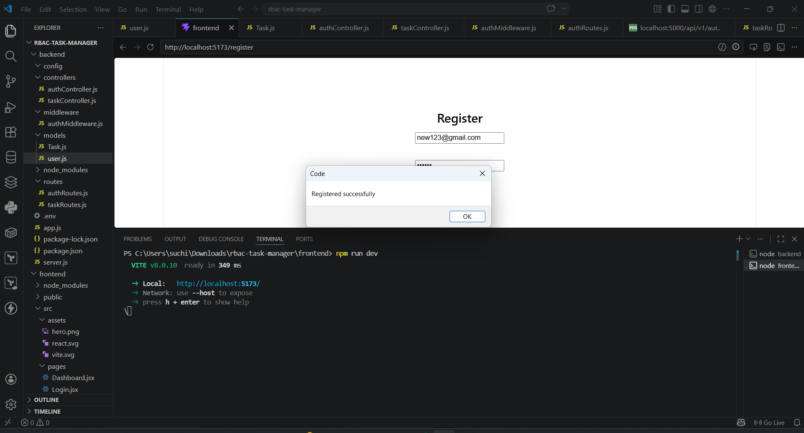
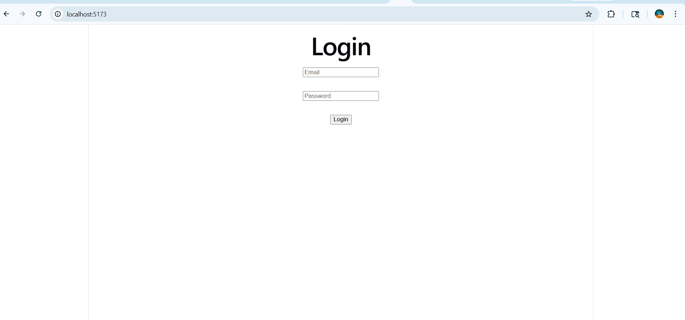
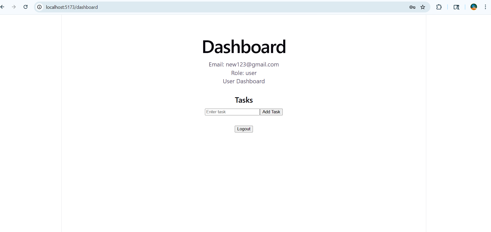

# RBAC Task Manager

A full-stack Task Manager application with authentication and role-based access control (RBAC). Users can register, log in, and manage their tasks securely using JWT-based authentication.

---

## Features

- User Registration and Login
- Password hashing using bcrypt
- JWT Authentication
- Role-Based Access Control (User / Admin)
- Protected routes using middleware
- CRUD operations for tasks
- Simple frontend UI for testing APIs
- API error handling and validation

---

## Tech Stack

Frontend:
- React (Vite)
- Axios

Backend:
- Node.js
- Express.js

Database:
- MongoDB (Mongoose)

Authentication:
- JWT (JSON Web Token)
- bcryptjs

---

## Project Structure

rbac-task-manager/
├── backend/
│   ├── controllers/
│   ├── models/
│   ├── routes/
│   ├── middleware/
│   ├── config/
│   └── server.js
│
├── frontend/
│   ├── src/
│   │   ├── pages/
│   │   ├── services/
│   │   └── App.jsx
│   └── index.html
│
└── README.md

---

## Installation & Setup

### 1. Clone Repository

git clone https://github.com/Suchitdev/rbac-task-manager.git  
cd rbac-task-manager  

---

### 2. Backend Setup

cd backend  
npm install  

Create a `.env` file in backend folder:

MONGO_URI=your_mongodb_connection  
JWT_SECRET=your_secret_key  
PORT=5000  

Run backend:

npm run dev  

---

### 3. Frontend Setup

cd frontend  
npm install  
npm run dev  

Frontend will run on:
http://localhost:5173  

---

## API Endpoints

### Auth Routes

POST /api/v1/auth/register  
POST /api/v1/auth/login  

---

### Task Routes (Protected)

GET /api/v1/tasks  
POST /api/v1/tasks  
DELETE /api/v1/tasks/:id  

---

## How Authentication Works

- User logs in and receives a JWT token
- Token is stored in localStorage
- Token is sent in Authorization header:
  
  Authorization: Bearer <token>

- Backend verifies token using middleware

---

## Role-Based Access

- User: Can manage their own tasks
- Admin: Can access admin-specific features (extendable)

---

## Testing APIs

You can test APIs using:
- Thunder Client (VS Code Extension)
- Postman

Steps:
1. Register a user
2. Login and get token
3. Use token in Authorization header
4. Access protected task routes

---

## Scalability Notes

- Modular folder structure (controllers, routes, middleware)
- Easy to extend with new modules
- Can be scaled using:
  - Microservices architecture
  - Load balancing
  - Caching (Redis)
  - Docker deployment

---
## Screenshots

### Register Page

### Login Page

### Dashboard

### Tasks

---

## Author

Suchit Deshmukh  
GitHub: https://github.com/Suchitdev